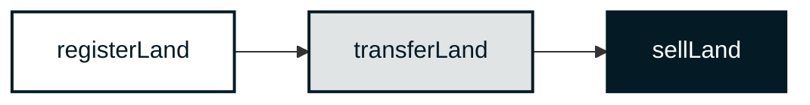

<div align="right">

  [](https://vscode.dev/redirect?url=vscode://ms-vscode-remote.remote-containers/cloneInVolume?url=https://github.com/block-foundation/solidity-land-registry)
  [](LICENSE.md)
  
  

</div>

---

<div>
    
    <h1 align="left">Decentralized Land Registry</h1>
    <h3 align="left">Block Foundation Smart Contract Series [Solidity]</h3>
</div>

---

<div>

<br>
<details open="open">
<summary>Table of Contents</summary>
  
- [Introduction](#introduction)
- [Quick Start](#quick-start)
- [Contract](#contract)
- [Background](background)
- [Development Resources](#development-resources)
- [Academic Resources](#development-resources)
- [Legal Information](#legal-information)

</details>
</div>

<br clear="both"/>

**Welcome to Block Foundation's Decentralized Land Registry project - an ambitious venture into the field of blockchain applications. This project is a part of our Smart Contract Series and leverages the full potential of Solidity, Ethereum's native programming language, to deliver a secure and transparent system for land transactions.**

## Introduction

Land registries have long been known for their lack of transparency and the potential for fraud, with numerous cases of illegal land acquisition and property disputes marring their history [^1]. Our solution, a Decentralized Land Registry, built on the foundation of blockchain technology, addresses these issues by providing a public, transparent, and immutable record of land transactions.

With our smart contract for the land registry system, an owner can register their land, update the land details, and even transfer ownership in a seamless and secure manner. Not only does this bring about a new level of trust and reliability to land transactions, but it also significantly reduces the potential for fraudulent activities.

This is an example of  a smart contract for a land registry system where an owner can register their land, update the land details, and even transfer ownership in a secure way. This contract makes land transactions more transparent and trustworthy.

The primary functionalities include:

1. Registration: When a user first registers a parcel of land, they are recorded as the owner of that parcel in the global state of the smart contract.

2. Land Update: The owner can update the details of their registered land. Any updates are recorded in the global state, ensuring that a history of changes is kept.

3. Ownership Transfer: If the owner decides to transfer their land, the contract allows for a seamless and secure transfer of ownership.

In addition, we've introduced enhanced features:

- Permissions: To prevent unauthorized users from registering or transferring land.
- Events: To keep track of every time a piece of land is registered or transferred.
- Sale functionality: Allows landowners to sell their land parcels.

This Decentralized Land Registry project is set to revolutionize how we view land transactions, bringing about a new level of transparency and security. We're excited to embark on this journey towards a more efficient, reliable, and secure system for land transactions, and we warmly invite you to explore, contribute, and grow with us in this endeavor.


HM Land Registry is an official organization in the United Kingdom that maintains a comprehensive and secure record of all registered land and property. This includes information about ownership, charges, easements, rights of way, and other interests affecting the land. It ensures that the records are accurate, thereby giving certainty of title to owners. These records are publicly accessible, allowing anyone to investigate the status of a parcel of land or property before making a purchase.

The primary services offered by HM Land Registry include:

1. Registering title to freehold and leasehold property.

2. Recording transactions that impact the registered title, such as transfers of ownership, mortgages, and leases.

3. Providing guaranteed title to registered estates and interests in land.

4. Providing a state-backed indemnity scheme for loss incurred as a result of a mistake or omission in the register or loss incurred in rectifying a mistake.

Here are some of the key differences between a traditional land registry like HM Land Registry and the blockchain-based LandRegistry contract described above:

1. **Decentralization**: The LandRegistry contract is based on a blockchain platform (like Ethereum), which is decentralized and not controlled by any single entity. This is in contrast to HM Land Registry, which is a government body.

2. **Transparency and Trust**: With the LandRegistry contract, all transactions are publicly visible and can't be changed once added to the blockchain. This might increase transparency and trust among users.

3. **Automation**: The LandRegistry contract uses smart contracts to automate processes such as registration and transfer of land. These operations are performed instantly, provided that they satisfy all the conditions defined in the contract. This contrasts with the HM Land Registry, which has a more manual, often lengthy process.

4. **Ownership Verification**: The LandRegistry contract allows instantaneous verification of ownership by simply querying the contract. In contrast, HM Land Registry requires a more involved process of requesting documents and verifying them.

5. **Middlemen**: Blockchain-based registries could potentially eliminate the need for intermediaries such as lawyers and notaries, thereby reducing costs. Traditional registries, on the other hand, often require several intermediaries to ensure the legality and validity of transactions.

6. **Regulatory Oversight and Legal Framework**: The HM Land Registry operates under a clear and established legal framework that provides legal recourse in cases of disputes. The legal status and implications of blockchain-based land registries, however, are still developing and may vary by jurisdiction.

7. **Access and Control**: Access to and control over the data in the HM Land Registry is limited to the organization itself and authorized individuals. With a blockchain-based contract, access is much more open, potentially allowing anyone to view and interact with the contract, provided they have the necessary blockchain infrastructure.

8. **Security**: While both systems have robust security measures in place, they face different kinds of threats. Blockchain contracts like LandRegistry can be vulnerable to bugs in the code or issues inherent to the blockchain platform itself. Traditional land registries, on the other hand, need to guard against issues like physical data damage or loss, unauthorized access, or hacking.


## Quick Start

Before you dive in, make sure you have Node.js and npm installed. You can then proceed to install the necessary dependencies:

> Install

``` sh
npm i
```

> To compile the smart contract:


``` sh
npm run compile
```

## Contract



This is a simple implementation and can be expanded to include more complex features, like adding permissions to prevent unauthorized people from registering or transferring land, or adding events to keep track of every time a piece of land is registered or transferred.

In this contract:

- `registerLand()` allows an address to register a new parcel of land with its location and a unique parcel ID. Emits a LandRegistered event when land is registered.
- `transferLand()` allows the current owner of a land parcel to transfer it to a new owner. Emits a LandTransferred event when land is transferred.
- `sellLand()` allows a landowner to sell their land to a buyer. This also involves the transfer of Ether (the currency on Ethereum) from the buyer to the seller, representing the payment for the land.
- `verifyLand()` allows anyone to verify the details of a land parcel.

Moreover:

- `price` on the `Land struct` handles selling land parcels.
- `onlyLandOwner` modifier to ensures that only the owner of a land parcel can perform certain actions.

*There is also a [PyTeal version](https://github.com/block-foundation/teal-land-registry) of this smart-contract, which offers similar functionality for the Algorand blockchain.*

## Background

### Evolving Land Management Systems

As we move deeper into the 21st century, traditional methods of managing land registries have proven to be insufficient, vulnerable to fraud, and fraught with red tape. In response, our project introduces a pioneering vision for the future of land management – the Decentralized Land Registry. By marrying the infallible security of blockchain with the expansive realm of property management, we're reshaping how property transactions are executed and recorded. This transformative project strives to make property transactions as seamless and as transparent as possible, thereby fortifying trust among parties involved.

### Incorporating Advanced Technologies

Our Decentralized Land Registry project employs advanced technologies, such as Ethereum's blockchain and Solidity, to craft a robust and secure framework for land transactions. The project is part of our Smart Contract Series that aims to demonstrate how blockchain can revolutionize various sectors and industries. The contract allows landowners to register land parcels, update details, and transfer ownership in a tamper-proof, transparent, and efficient manner.

### A Step towards Greater Transparency

Transparency is the cornerstone of any trusted system. Our project ensures complete transparency in land transactions, thereby minimizing disputes and fraudulent activities. By recording transactions on the blockchain, we provide a public and immutable ledger, thus instilling a greater level of confidence in the process. As a result, the Decentralized Land Registry is set to change the way we perceive land transactions, ushering in a new era of trust, transparency, and efficiency.

### Open Source and Community Oriented

As an open-source project, the Decentralized Land Registry encourages community participation and contribution. We believe that the combined efforts and creativity of the global developer community can accelerate the evolution of our project and bring innovative solutions to the fore. We warmly welcome developers worldwide to join our mission, contribute to our codebase, and help us build a more transparent, efficient, and secure system for land transactions.

## Development Resources

### Authors

This is an open-source project by the **[Block Foundation](https://www.blockfoundation.io "Block Foundation website")**.

The Block Foundation mission is enabling architects to take back initiative and contribute in solving the mismatch in housing through blockchain technology. Therefore the Block Foundation seeks to unschackle the traditional constraints and construct middle ground between rent and the rigidity of traditional mortgages.

website: [www.blockfoundation.io](https://www.blockfoundation.io "Block Foundation website")

### Contributing

We'd love for you to contribute and to make this project even better than it is today!
Please refer to the [contribution guidelines](.github/CONTRIBUTING.md) for information.

### Other Repositories

#### Block Foundation Smart Contract Series

|                                   | `Solidity`  | `Teal`      |
| --------------------------------- | ----------- | ----------- |
| **Template**                      | [**>>>**](https://github.com/block-foundation/solidity-template) | [**>>>**](https://github.com/block-foundation/teal-template) |
| **Architectural Design**          | [**>>>**](https://github.com/block-foundation/solidity-architectural-design) | [**>>>**](https://github.com/block-foundation/teal-architectural-design) |
| **Architecture Competition**      | [**>>>**](https://github.com/block-foundation/solidity-architecture-competition) | [**>>>**](https://github.com/block-foundation/teal-architecture-competition) |
| **Housing Cooporative**           | [**>>>**](https://github.com/block-foundation/solidity-housing-cooperative) | [**>>>**](https://github.com/block-foundation/teal-housing-cooperative) |
| **Land Registry**                 | [**>>>**](https://github.com/block-foundation/solidity-land-registry) | [**>>>**](https://github.com/block-foundation/teal-land-registry) |
| **Real-Estate Crowdfunding**      | [**>>>**](https://github.com/block-foundation/solidity-real-estate-crowdfunding) | [**>>>**](https://github.com/block-foundation/teal-real-estate-crowdfunding) |
| **Rent-to-Own**                   | [**>>>**](https://github.com/block-foundation/solidity-rent-to-own) | [**>>>**](https://github.com/block-foundation/teal-rent-to-own) |
| **Self-Owning Building**          | [**>>>**](https://github.com/block-foundation/solidity-self-owning-building) | [**>>>**](https://github.com/block-foundation/teal-self-owning-building) |
| **Smart Home**                    | [**>>>**](https://github.com/block-foundation/solidity-smart-home) | [**>>>**](https://github.com/block-foundation/teal-smart-home) |

## Academic Resources

### Citation

> A sample citation (APA 6th edition) might look like:  

``` txt
van Vianen, L. B. (2023). solidity-land-registry (Version 0.0.1) [Computer software].
```

> BibTeX

``` bib
@misc{van_vianen_solidity-land-registry_2023,
	title = {solidity-land-registry},
	copyright = {CC-BY-SA-4.0},
	url = {https://github.com/block-foundation/solidity-land-registry},
	abstract = {Solidity Smart Contract: Decentralized Land Registry},
	urldate = {2023-07-25},
	author = {van Vianen, Lars Bastiaan},
	month = jul,
	year = {2023},
	note = {original-date: 2023-07-23T22:52:59Z},
}

```

## Legal Information

### Copyright

Copyright 2023, [Stichting Block Foundation](https://www.blockfoundation.io). All rights reserved.

### License

Except as otherwise noted, the content in this repository is licensed under the
[Creative Commons Attribution 4.0 International (CC BY 4.0) License](https://creativecommons.org/licenses/by/4.0/), and
code samples are licensed under the [Apache 2.0 License](http://www.apache.org/licenses/LICENSE-2.0).

Also see [LICENSE](https://github.com/block-foundation/community/blob/master/LICENSE) and [LICENSE-CODE](https://github.com/block-foundation/community/blob/master/LICENSE-CODE).

### Warning

**Please note that this code should be audited by a professional smart-contract auditor before being used in a production environment as it is a simplified example and may not cover all potential security vulnerabilities.**

### Disclaimer

**THIS SOFTWARE IS PROVIDED AS IS WITHOUT WARRANTY OF ANY KIND, EITHER EXPRESS OR IMPLIED, INCLUDING ANY IMPLIED WARRANTIES OF FITNESS FOR A PARTICULAR PURPOSE, MERCHANTABILITY, OR NON-INFRINGEMENT.**

## References

For more research resources, please also visit our general [bibliography](https://github.com/block-foundation/bibliography).

[^1]: Ameyaw, P. D., & de Vries, W. T. (2021). Toward Smart Land Management: Land Acquisition and the Associated Challenges in Ghana. A Look into a Blockchain Digital Land Registry for Prospects. Land, 10(3), Article 3. https://doi.org/10.3390/land10030239
