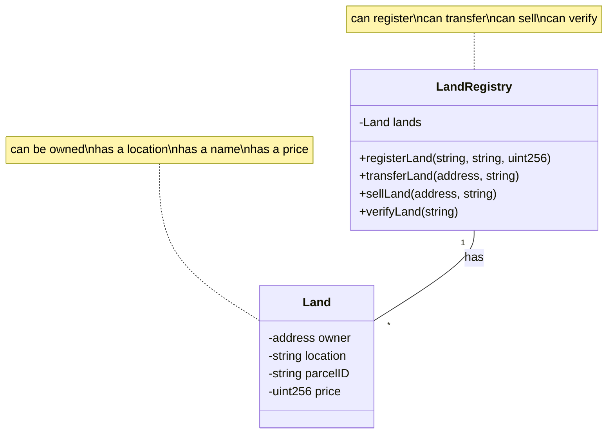
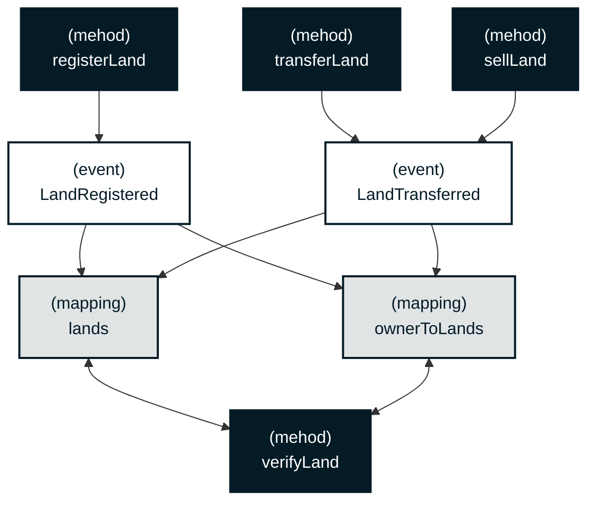

<div align="right">

[](https://github.com/block-foundation/solidity-land-registry/blob/main/LICENSE)
[](https://vscode.dev/redirect?url=vscode://ms-vscode-remote.remote-containers/cloneInVolume?url=https://github.com/block-foundation/solidity-land-registry)

</div>

---

<div>
    
    <h1 align="left">Decentralized Land Registry</h1>
    <h3 align="left">Block Foundation Smart Contract Series [Solidity]</h3>
</div>

---


### Contents

- [Introduction](#introduction)
- [Colophon](#colophon)

<br clear="both"/>

---

<div align="right">

[](https://github.com/block-foundation/solidity-land-registry/issues/new?assignees=&labels=Needs%3A+Triage+%3Amag%3A%2Ctype%3Abug-suspected&projects=&template=bug_report.yml)
[](https://github.com/block-foundation/solidity-land-registry/issues/new?assignees=&labels=Needs%3A+Triage+%3Amag%3A%2Ctype%3Abug-suspected&projects=&template=feature_request.yml)
[](https://github.com/block-foundation/solidity-land-registry/issues/new?assignees=&labels=Needs%3A+Triage+%3Amag%3A%2Ctype%3Abug-suspected&projects=&template=question.yml)
[](https://github.com/block-foundation/solidity-land-registry/issues/new?assignees=&labels=Needs%3A+Triage+%3Amag%3A%2Ctype%3Abug-suspected&projects=&template=suggestion.yml)
[](https://github.com/block-foundation/solidity-land-registry/issues/new?assignees=&labels=Needs%3A+Triage+%3Amag%3A%2Ctype%3Abug-suspected&projects=&template=discussion.yml)

</div>

**Welcome to Block Foundation's Decentralized Land Registry project as part of our Smart Contract Series. It leverages the full potential of smart contracts to deliver a secure and transparent system for land transactions.**

## Introduction

Land registries have long been known for their lack of transparency and the potential for fraud, with numerous cases of illegal land acquisition and property disputes marring their history [^1]. Our solution, a Decentralized Land Registry, built on the foundation of blockchain technology, addresses these issues by providing a public, transparent, and immutable record of land transactions.

With our smart contract for the land registry system, an owner can register their land, update the land details, and even transfer ownership in a seamless and secure manner. Not only does this bring about a new level of trust and reliability to land transactions, but it also significantly reduces the potential for fraudulent activities.

This smart contract for a land registry system in which land transactions are more transparent and trustworthy, and allows an owner to register their land, update the land details, and  transfer ownership in a secure way.

The primary functionalities include:

1. Registration: When a user first registers a parcel of land, they are recorded as the owner of that parcel in the global state of the smart contract.

2. Land Update: The owner can update the details of their registered land. Any updates are recorded in the global state, ensuring that a history of changes is kept.

3. Ownership Transfer: If the owner decides to transfer their land, the contract allows for a seamless and secure transfer of ownership.

## Quick Start

Before you dive in, make sure you have Node.js and npm installed. You can then proceed to install the necessary dependencies:

> Install

``` sh
npm i
```

> To compile the smart contract:

``` sh
npm run compile
```

## Contract

This is a simple implementation and can be expanded to include more complex features, like adding permissions to prevent unauthorized people from registering or transferring land.

### Class Overview



### Class Flow



- `registerLand()` allows an address to register a new parcel of land with its location and a unique parcel ID. Emits a `LandRegistered` event when land is registered.
- `transferLand()` allows the current owner of a land parcel to transfer it to a new owner. Emits a `LandTransferred` event when land is transferred.
- `sellLand()` allows a landowner to sell their land to a buyer. This also involves the transfer of Ether (the currency on Ethereum) from the buyer to the seller, representing the payment for the land.
- `verifyLand()` allows anyone to verify the details of a land parcel.
- `listLandsByOwner()` allows for querying all land parcels owned by a specific `address`, making it easier to get an overview of one's properties

Moreover:

- `price` on the `Land struct` handles selling land parcels.
- `onlyLandOwner` modifier to ensures that only the owner of a land parcel can perform certain actions.

*There is also a [PyTeal version](https://github.com/block-foundation/teal-land-registry) of this smart-contract, which offers similar functionality for the Algorand blockchain.*

## Background

### Evolving Land Management Systems

As we move deeper into the 21st century, traditional methods of managing land registries have proven to be insufficient, vulnerable to fraud, and fraught with red tape. In response, our project introduces a pioneering vision for the future of land management – the Decentralized Land Registry. By marrying the infallible security of blockchain with the expansive realm of property management, we're reshaping how property transactions are executed and recorded. This transformative project strives to make property transactions as seamless and as transparent as possible, thereby fortifying trust among parties involved.

### Incorporating Advanced Technologies

Our Decentralized Land Registry project employs advanced technologies, such as Ethereum's blockchain and Solidity, to craft a robust and secure framework for land transactions. The project is part of our Smart Contract Series that aims to demonstrate how blockchain can revolutionize various sectors and industries. The contract allows landowners to register land parcels, update details, and transfer ownership in a tamper-proof, transparent, and efficient manner.

### A Step towards Greater Transparency

Transparency is the cornerstone of any trusted system. Our project ensures complete transparency in land transactions, thereby minimizing disputes and fraudulent activities. By recording transactions on the blockchain, we provide a public and immutable ledger, thus instilling a greater level of confidence in the process. As a result, the Decentralized Land Registry is set to change the way we perceive land transactions, ushering in a new era of trust, transparency, and efficiency.

### Open Source and Community Oriented

As an open-source project, the Decentralized Land Registry encourages community participation and contribution. We believe that the combined efforts and creativity of the global developer community can accelerate the evolution of our project and bring innovative solutions to the fore. We warmly welcome developers worldwide to join our mission, contribute to our codebase, and help us build a more transparent, efficient, and secure system for land transactions.

## Development Resources

### Authors

This is an open-source project by the **[Block Foundation](https://www.blockfoundation.io "Block Foundation website")**.

The Block Foundation mission is enabling architects to take back initiative and contribute in solving the mismatch in housing through blockchain technology. Therefore the Block Foundation seeks to unschackle the traditional constraints and construct middle ground between rent and the rigidity of traditional mortgages.

website: [www.blockfoundation.io](https://www.blockfoundation.io "Block Foundation website")

### Contributing

We'd love for you to contribute and to make this project even better than it is today!
Please refer to the [contribution guidelines](.github/CONTRIBUTING.md) for information.

### Other Repositories

- https://github.com/vrii14/Land-Registration-with-Blockchain

#### Block Foundation Smart Contract Series

|                                   | `Solidity`  | `Teal`      |
| --------------------------------- | ----------- | ----------- |
| **Template**                      | [**>>>**](https://github.com/block-foundation/solidity-template) | [**>>>**](https://github.com/block-foundation/teal-template) |
| **Architectural Design**          | [**>>>**](https://github.com/block-foundation/solidity-architectural-design) | [**>>>**](https://github.com/block-foundation/teal-architectural-design) |
| **Architecture Competition**      | [**>>>**](https://github.com/block-foundation/solidity-architecture-competition) | [**>>>**](https://github.com/block-foundation/teal-architecture-competition) |
| **Housing Cooporative**           | [**>>>**](https://github.com/block-foundation/solidity-housing-cooperative) | [**>>>**](https://github.com/block-foundation/teal-housing-cooperative) |
| **Land Registry**                 | [**>>>**](https://github.com/block-foundation/solidity-land-registry) | [**>>>**](https://github.com/block-foundation/teal-land-registry) |
| **Real-Estate Crowdfunding**      | [**>>>**](https://github.com/block-foundation/solidity-real-estate-crowdfunding) | [**>>>**](https://github.com/block-foundation/teal-real-estate-crowdfunding) |
| **Rent-to-Own**                   | [**>>>**](https://github.com/block-foundation/solidity-rent-to-own) | [**>>>**](https://github.com/block-foundation/teal-rent-to-own) |
| **Self-Owning Building**          | [**>>>**](https://github.com/block-foundation/solidity-self-owning-building) | [**>>>**](https://github.com/block-foundation/teal-self-owning-building) |
| **Smart Home**                    | [**>>>**](https://github.com/block-foundation/solidity-smart-home) | [**>>>**](https://github.com/block-foundation/teal-smart-home) |

## Academic Resources

### Citation

> A sample citation (APA 6th edition) might look like:  

``` txt
van Vianen, L. B. (2023). solidity-land-registry (Version 0.0.1) [Computer software].
```

> BibTeX

``` bib
@misc{van_vianen_solidity-land-registry_2023,
	title = {solidity-land-registry},
	copyright = {CC-BY-SA-4.0},
	url = {https://github.com/block-foundation/solidity-land-registry},
	abstract = {Solidity Smart Contract: Decentralized Land Registry},
	urldate = {2023-07-25},
	author = {van Vianen, Lars Bastiaan},
	month = jul,
	year = {2023},
	note = {original-date: 2023-07-23T22:52:59Z},
}

```

---

## Colophon

### Authors

This is an open-source project by the **[Block Foundation](https://www.blockfoundation.io "Block Foundation website")**.

The Block Foundation mission is enabling architects to take back initiative and contribute in solving the mismatch in housing through blockchain technology. Therefore the Block Foundation seeks to unschackle the traditional constraints and construct middle ground between rent and the rigidity of traditional mortgages.

website: [www.blockfoundation.io](https://www.blockfoundation.io "Block Foundation website")

### Development Resources

#### Contributing

We'd love for you to contribute and to make this project even better than it is today!
Please refer to the [contribution guidelines](.github/CONTRIBUTING.md) for information.

### Legal Information

#### Copyright

Copyright &copy; 2023 [Stichting Block Foundation](https://www.blockfoundation.io/ "Block Foundation website"). All Rights Reserved.

#### License

Except as otherwise noted, the content in this repository is licensed under the
[Creative Commons Attribution 4.0 International (CC BY 4.0) License](https://creativecommons.org/licenses/by/4.0/), and
code samples are licensed under the [Apache 2.0 License](http://www.apache.org/licenses/LICENSE-2.0).

Also see [LICENSE](https://github.com/block-foundation/community/blob/master/src/LICENSE) and [LICENSE-CODE](https://github.com/block-foundation/community/blob/master/src/LICENSE-CODE).

#### Disclaimer

**THIS SOFTWARE IS PROVIDED AS IS WITHOUT WARRANTY OF ANY KIND, EITHER EXPRESS OR IMPLIED, INCLUDING ANY IMPLIED WARRANTIES OF FITNESS FOR A PARTICULAR PURPOSE, MERCHANTABILITY, OR NON-INFRINGEMENT.**
